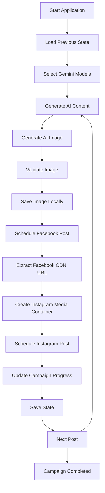

# 🚀 MetaGenAI Scheduler


## 📌 Overview

MetaGenAI Scheduler is an AI-powered social media automation platform that automatically generates content, creates images, and schedules posts for Facebook and Instagram using Google Gemini AI, Imagen AI, and Meta Graph API.

The system is designed to automate a complete 30-day social media campaign with minimal human intervention while maintaining content consistency and scheduling reliability.

---

# ✅ Project Status

### Production Ready & Completed

This project has been successfully designed, developed, tested, and completed.

### Completed Modules

✅ AI Content Generation Engine

✅ AI Image Generation Engine

✅ Facebook Post Scheduling

✅ Instagram Post Scheduling

✅ Meta Graph API Integration

✅ Campaign Progress Tracking

✅ State Persistence & Recovery

✅ Pause / Resume Functionality

✅ Multi-Day Campaign Automation

✅ Desktop GUI Dashboard

---

# 🎯 Key Features

### 🤖 AI Content Generation

* Generates Facebook Posts
* Generates Instagram Captions
* Generates Image Prompts
* Uses Google Gemini Models

### 🎨 AI Image Generation

* Gemini Image Models Support
* Imagen Models Support
* Automatic Image Validation
* Automatic Image Optimization

### 📅 Campaign Scheduling

* 30-Day Campaign Automation
* 270 Total Posts
* 9 Posts Per Day
* Custom Start Date Support

### 📱 Social Media Automation

* Facebook Page Scheduling
* Instagram Business Scheduling
* Automated Publishing Workflow
* Meta Graph API Integration

### 💾 State Management

* Pause & Resume
* Automatic Progress Saving
* Crash Recovery
* Campaign Continuation Support

### 🖥 GUI Dashboard

* Model Selection
* API Configuration
* Real-Time Logs
* Progress Tracking
* Campaign Control Panel

---

# 🏗 System Architecture

```text
┌───────────────────────────┐
│      User Interface       │
│        (Tkinter)          │
└─────────────┬─────────────┘
              │
              ▼
┌───────────────────────────┐
│   Campaign Controller     │
└───────┬─────────┬─────────┘
        │         │
        ▼         ▼

┌──────────────┐   ┌──────────────┐
│ Gemini AI    │   │ Imagen AI    │
│ Text Engine  │   │ Image Engine │
└──────┬───────┘   └──────┬───────┘
       │                  │
       └────────┬─────────┘
                ▼

┌───────────────────────────┐
│   Content Processor       │
└─────────────┬─────────────┘
              ▼

┌───────────────────────────┐
│  Local Image Storage      │
└─────────────┬─────────────┘
              ▼

┌───────────────────────────┐
│      Meta Graph API       │
└───────┬─────────┬─────────┘
        │         │
        ▼         ▼

┌──────────────┐ ┌──────────────┐
│ Facebook     │ │ Instagram    │
│ Publishing   │ │ Publishing   │
└──────────────┘ └──────────────┘
```

---

# 🔄 Workflow



---

# 📂 Project Structure

```text
MetaGenAI-Scheduler/

├── MetaGenAI-Scheduler.py
├── automation_state.json
├── README.md
├── requirements.txt

├── generated_images/
├── logs/

└── assets/
```

---

# ⚙️ Technology Stack

| Component            | Technology       |
| -------------------- | ---------------- |
| Programming Language | Python           |
| GUI Framework        | Tkinter          |
| AI Text Generation   | Google Gemini    |
| AI Image Generation  | Imagen / Gemini  |
| API Integration      | Meta Graph API   |
| HTTP Communication   | Requests         |
| Image Processing     | Pillow           |
| Data Storage         | JSON             |
| Concurrency          | Python Threading |

---

# 📊 Campaign Capacity

| Metric               | Value                |
| -------------------- | -------------------- |
| Campaign Duration    | 30 Days              |
| Posts Per Day        | 9                    |
| Total Posts          | 270                  |
| Platforms            | Facebook + Instagram |
| AI Generated Content | Yes                  |
| AI Generated Images  | Yes                  |
| Pause / Resume       | Yes                  |
| Progress Recovery    | Yes                  |

---

# 🔐 Configuration

```python
FB_PAGE_ID="YOUR_PAGE_ID"

IG_ACCOUNT_ID="YOUR_INSTAGRAM_ACCOUNT_ID"

META_ACCESS_TOKEN="YOUR_META_ACCESS_TOKEN"

GEMINI_API_KEY="YOUR_GEMINI_API_KEY"
```

---

# 🚀 Installation

```bash
git clone https://github.com/yourusername/MetaGenAI-Scheduler.git

cd MetaGenAI-Scheduler

pip install -r requirements.txt

python MetaGenAI-Scheduler.py
```

---

# 📈 Engineering Highlights

This project demonstrates practical implementation of:

* AI Workflow Automation
* Social Media Process Automation
* API Integration Engineering
* Content Generation Pipelines
* Campaign Orchestration
* State Management Systems
* Recovery Mechanisms
* Desktop Application Development

---

# 🌟 Real-World Use Cases

* Digital Marketing Agencies
* Affiliate Marketing Businesses
* E-commerce Brands
* Social Media Managers
* Content Publishers
* Personal Branding Campaigns
* Automated Marketing Operations

---

# 🔮 Future Enhancements

* LinkedIn Automation
* Pinterest Integration
* Multi-Language Content Generation
* AI Content Performance Analytics
* Content Approval Workflow
* Docker Containerization
* AWS Cloud Deployment
* SaaS Dashboard Version

---

# 📜 Disclaimer

This project is intended for educational, research, and automation engineering purposes.

Users are responsible for complying with:

* Meta Platform Policies
* Facebook Platform Policies
* Instagram Platform Policies
* Google AI Terms of Service

---

# 👨‍💻 Author

## Imon Mahmud

### IT SPECIALIST | CLOUD INFRASTRUCTURE & AI AUTOMATION ENGINEER

### Core Skills

* AWS Cloud Infrastructure
* Cloud Architecture
* DevOps Automation
* Infrastructure as Code (Terraform)
* Python Development
* AI Workflow Automation
* API Integration Engineering
* Social Media Automation Systems

---

## 🎯 Portfolio Project

This project was built as a production-oriented portfolio project demonstrating practical integration of:

* Google Gemini AI
* Imagen AI
* Meta Graph API
* Python Automation
* Workflow Orchestration
* Enterprise Automation Concepts

with a real-world business automation use case.

---

⭐ If you found this project useful, consider giving it a star.
